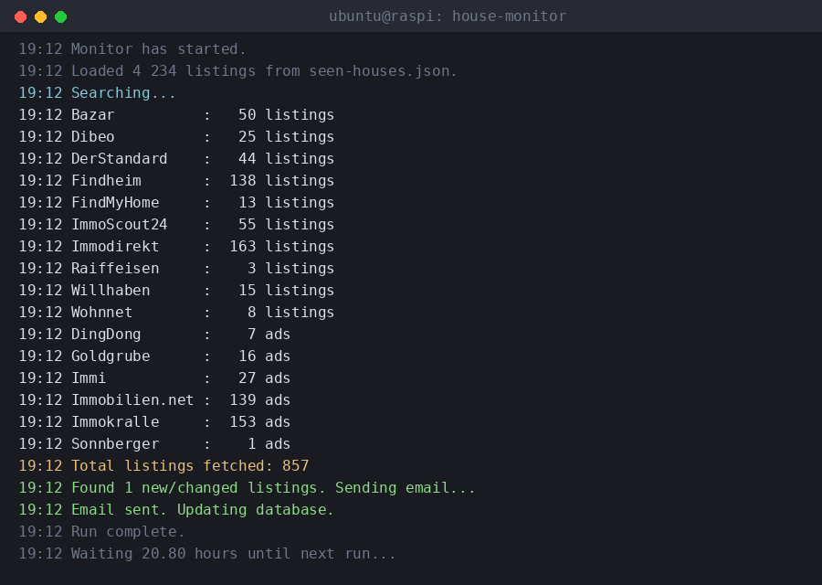

# house-monitor

[](https://github.com/griffffffin/house-monitor/actions/workflows/tests.yml)
[](LICENSE)
[](pyproject.toml)

An asyncio-based Python scraper that watches 19 Austrian real-estate websites for cheap houses and emails a summary whenever a new listing appears or an existing one drops in price.

## Why this exists

I was house-hunting in Austria and got tired of manually refreshing a dozen different real-estate sites every day, each with its own filters, its own quirks, and no unified way to see "what's new since yesterday." So I built a scraper that does it for me, runs unattended on a Raspberry Pi, and only bothers me by email when there's actually something worth looking at.

It's grown into a small but genuinely useful piece of infrastructure: it's been running in production for months, has caught real price drops, and has survived several of the target sites redesigning their HTML out from under it.

## What it does

- Scrapes 19 independent, heterogeneous real-estate sites (plain server-rendered HTML, React/Next.js SSR JSON blobs, a Drupal Views table, a WordPress/Houzez theme, a JSON REST API, session-based pagination, and more) behind one common interface
- Filters by price range and a configurable blacklist (e.g. holiday homes, reserved listings)
- Detects both **new** listings and **price changes** on listings it's already seen
- Cross-platform duplicate detection — the same house is often listed on more than one site; a fuzzy title+price match avoids emailing about it twice
- Sends a single, grouped-by-source email summary instead of one email per listing
- Persists what it's seen to a local JSON file with corruption-tolerant loading and atomic (crash-safe) writes

## Architecture

Originally a single ~3000-line script, later split into a proper package for maintainability:

```
house_monitor/
├── models.py         # Listing dataclass + shared parsing helpers (price parsing, encoding fallback)
├── config.py         # price filter, blacklist, per-site URLs, env-driven email config
├── logging_setup.py  # a custom log level that keeps interactive console output readable
├── email_notifier.py # SMTP sending
├── scrapers/          # one file per site, each exposing an async fetch_listings()
├── monitor.py         # orchestrates scrapers, dedupe, email, persistence
└── main.py             # entry point (file lock + asyncio.run)

tests/                 # 68 unit tests, no network calls (see Tests below)
scripts/               # live_smoke_check.py — the real-network counterpart to the tests
```

### A few things worth pointing out

- **All 19 scrapers run concurrently** via `asyncio.gather(..., return_exceptions=True)`. They used to run sequentially — switching to concurrent execution cut the total run time from several minutes to well under one, and as a side effect, one scraper throwing an exception (a site going down, a layout change) no longer takes down the whole run; that source is just skipped for that cycle, logged, and the rest continue normally.
- **Resilient persistence**: a single corrupted entry in the JSON database doesn't wipe out the whole thing (it's loaded line-by-line with per-entry error handling), and writes go to a temp file followed by an atomic `os.replace()`, so a crash or power loss mid-write can't leave a truncated database.
- **Two-tier logging**: a custom `NOTICE` log level sits between `INFO` and `WARNING`. When run interactively, the console only shows `NOTICE`+ (start/stop, per-source result counts, email outcome) in a compact, column-aligned format — the noisy page-by-page scraping detail still goes to the log file in full, for when you actually need to debug something.
- **68 unit tests**, no network calls or real email sends — pure parsing/filtering/serialization logic, including a dedicated HTML/JSON-fixture parsing test for every one of the 19 scrapers, plus regression tests for HTML-structure changes on specific sites that broke silently in the past.

## Running it

```bash
pip install -r requirements.txt
```

Set the following environment variables (see `.env.example`):

```
HOUSE_MONITOR_SMTP_SERVER=smtp.gmail.com
HOUSE_MONITOR_SMTP_PORT=587
HOUSE_MONITOR_SENDER_EMAIL=you@example.com
HOUSE_MONITOR_SENDER_PASSWORD=your-app-password
HOUSE_MONITOR_RECIPIENT_EMAIL=you@example.com
```

Then:

```bash
python3 -m house_monitor.main
```

Price range, blacklist words, and the schedule are all configured in `house_monitor/config.py`.

## Tests

```bash
python3 -m pytest tests/ -v
```

Every scraper has a unit test that feeds it a hand-built HTML (or JSON, for the API-based ones) fixture and checks the extracted id/title/url/price. These are pure unit tests, though — no real network calls — so they verify parsing logic against a known structure, they can't detect a live site changing its HTML out from under the scraper. That's a real, deliberate limitation: it's happened before (see `CLAUDE.md` for the Findheim incident, where a site redesign caused months of silent zero-result runs before anyone noticed) and would only be caught by noticing an unexpectedly quiet source in production, then adding a regression test for the new structure.

### Live smoke check

```bash
python3 -m scripts.live_smoke_check
```

Runs every scraper for real, against the live sites, with no price/blacklist filtering and no email/database side effects — just a per-source result count, sorted so 0-result (or errored) sources float to the top. This is the counterpart to the unit tests above: it can't run in CI (network-dependent, and a 0 doesn't always mean "broken" — most scrapers also apply their own internal price-range filter, so it can just as easily mean "nothing in range right now"), but it's the fastest way to sanity-check all 19 sources at once when something feels off, instead of checking them one by one by hand.

### Dev tooling

```bash
pip install -r requirements-dev.txt
black house_monitor/ tests/
ruff check house_monitor/ tests/
mypy house_monitor/
```

Optionally, install the [pre-commit](https://pre-commit.com/) hooks to run the same checks automatically before every commit, instead of only in CI:

```bash
pip install pre-commit
pre-commit install
```

Dependency updates (both Python packages and the CI workflow's own actions) are handled by [Dependabot](.github/dependabot.yml), which opens a PR automatically on a weekly schedule.

## Sample output

Compact console output from a manual run (`NOTICE`-level: milestones only, per-source counts, email outcome — full page-by-page detail goes to the log file instead):



The email itself is grouped by source. The real emails are in Hungarian (the owner's language) - this is the same layout translated to English:

```
==============    Sonnberger (2 listings)    ==============

1. Cozy house with garden
   Price: 45 000 €
   Link: https://sonnberger.co.at/wp/immobilien/...

2. Large villa with pool
   Price: 68 000 €
   Link: https://sonnberger.co.at/wp/immobilien/...
```

## A note on how this was built

This project was developed with heavy use of [Claude Code](https://claude.com/claude-code) as a pair-programming tool — the `.claude/` directory and `CLAUDE.md` in this repo are left in intentionally, as a record of that workflow (project-specific context, conventions, and gotchas that got fed back into future sessions).
